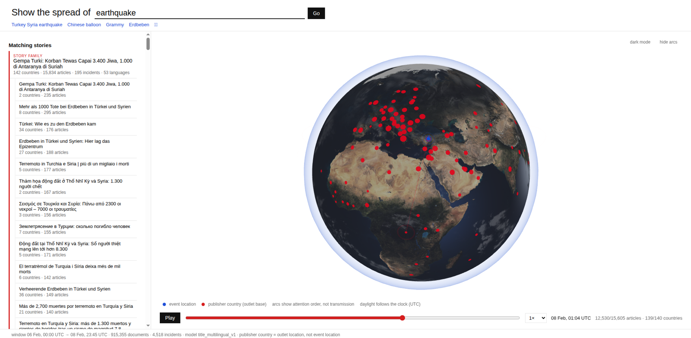
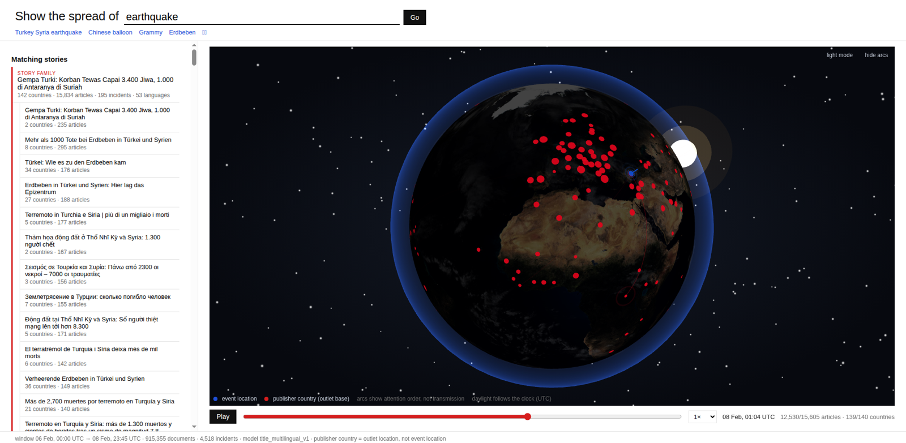
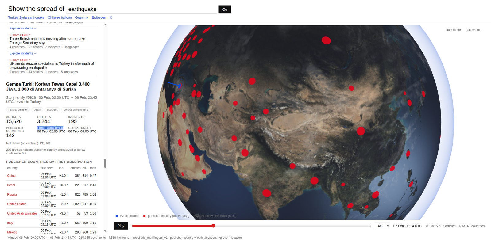
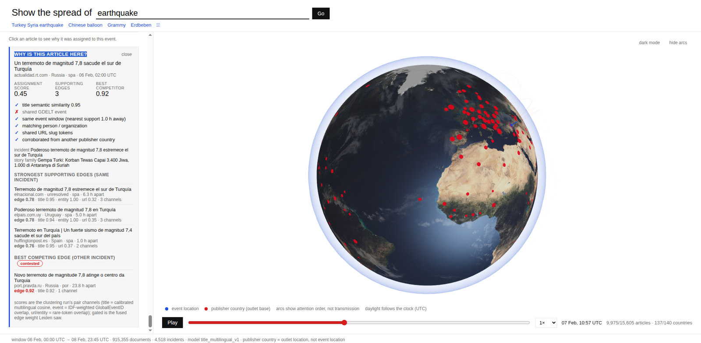
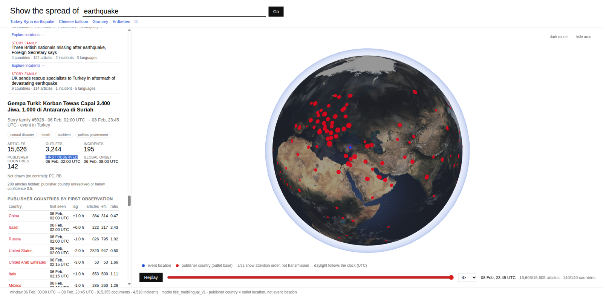

# Ripple global news event resolution and attention propagation

Ripple turns GDELT's noisy, multilingual, heavily syndicated news stream into
real-world stories, then shows how media attention to each story spreads across
publisher countries over time on an interactive 3D globe.



<table><tr>
<td></td>
<td></td>
</tr><tr>
<td></td>
<td></td>
</tr></table>

*Blue beacon = event location (GDELT lat/lon). Red markers = publisher
countries (where the outlet is based), lit in observation order. Arcs show
attention order, not transmission. Full write-up: [`docs/project-report.md`](docs/project-report.md).*

## About

Built at **HackMIT 2026** for the **Education track**, and submitted to the
**Voloridge** (*"Signal in the Noise"*), **Cognition** and **Ramp** sponsor
challenges. The educational goal: let anyone, a student, a journalist, a
policy class pick a real-world event and *see* how the world's media noticed
it: which countries reported first, which lagged, how attention grew hour by
hour, and, for any single article, why the system believes it belongs to that
event. The technical goal is the Voloridge brief: find real structure in a
large, noisy, redundant dataset and make it legible.

Our dataset is [GDELT](https://www.gdeltproject.org/), which monitors news in
65+ languages every 15 minutes on our benchmark window ~300k documents a day,
most of them syndicated copies, translations or near-duplicates of far fewer
actual events.

Ripple treats this as a **research problem in event resolution under
uncertainty**. Each article is a noisy observation of an unknown real-world
event; four independent evidence channels (calibrated multilingual title
similarity, IDF-weighted `GlobalEventID` overlap, rare URL-slug tokens, rare
GKG persons/organisations) vote on whether two articles observe the same event,
an evidence gate refuses to link on a single weak signal, and Constant Potts
Model Leiden clustering resolves the surviving graph into incidents and story
families. Articles without sufficient evidence are left unassigned by design
*abstention over false certainty*. Every assignment is explainable per article,
every run is deterministic, and every quality number is measured against
labelled data.

Stack: Python 3.12 · Polars · sentence-transformers · FAISS · igraph/Leiden ·
FastAPI · React + TypeScript · Three.js / React Three Fiber. Full technical
write-up: [`docs/project-report.md`](docs/project-report.md).

Ripple is designed for GDELT's multi-terabyte archive; every number below comes
from the one fully processed three-day window (Feb 6–8 2023: Turkey–Syria
earthquake, Chinese balloon, State of the Union, Grammys, Ohio derailment).

```
raw 15-min zips preprocess─▶ typed Parquet ─atomic─▶ documents / atomic events
  ─embed─▶ multilingual title vectors ─cluster─▶ incidents → story families
  ─materialize─▶ attention store ─FastAPI─▶ /api/v2/attention/* ─▶ R3F globe
```

| Measured on Feb 6–8 2023 | |
|---|---|
| raw compressed GDELT (Events, Mentions, GKG, English + translated) | 4.33 GB |
| typed analytical Parquet | 348 MB (**12.4×** smaller) |
| GKG documents / with page title / languages / domains | 914,199 / 909,599 / 63 / 14,635 |
| documents with a resolved publisher country | 98.9 % |
| candidate pairs → evidence-gated edges | 47.5 M → 11.4 M |
| incidents / story families | 120,026 / 103,076 |
| documents deliberately left unassigned | 11.5 % |
| Turkey–Syria earthquake family | 17,204 docs, 291 incidents, 143 publisher countries, 55 languages (15,834 docs / 195 incidents served as macro-events ≥ 30 docs) |

Design principle: **Ripple prefers abstention over false certainty.** A document
without sufficient evidence stays unassigned rather than contaminating a story; a
false merge is visible on the globe and in the evidence panel, a split costs recall.

## Run it

```sh
curl -LsSf https://astral.sh/uv/0.12.13/install.sh | sh && export PATH="$HOME/.local/bin:$PATH"
uv sync --locked
# GDELT's outlet→country lookup (tab-separated domain, FIPS code, country name); see
# https://blog.gdeltproject.org/mapping-the-media-a-geographic-lookup-of-gdelts-sources/
export GDELT_DOMAIN_LOOKUP=/path/to/MASTER-GDELTDOMAINSBYCOUNTRY-MAY2018.TXT
scripts/run_window.sh 20230206 20230206 20230208       # fetch → … → data/store/20230206
GDELT_ATTENTION_DATA=data/store/20230206 uv run uvicorn api.app:app --port 8000
cd web && npm install && npm run dev                    # http://localhost:5173/spread.html
```

`scripts/run_window.sh` chains the six stages below (plus
`attention.analytics`, which materialises the country-response observations the
Country Stats tab reads; the API derives them on first use if the file is
missing); each stage is a module with `--help` and can be rerun on its own. The raw window is ~1.4–1.8 GB zipped per
day. On a CPU-only box: preprocess ≈ 10 min, embedding ≈ 38 min per 0.9 M titles
(the one step a GPU collapses to minutes; embeddings are cached in 20k-title
shards and resume after interruption), full clustering ≈ 61 min, re-gating from
cached pair features ≈ 8.5 min, materialize ≈ 4 min.

### Deploy

The globe is a static Vite site and the API is a small FastAPI process over
Parquet; deploy them separately (the ML dependencies are only needed to *build*
a store, not to serve one).

```sh
# API host (any box with the store; ~100 MB of deps, no torch/faiss)
uv venv --python 3.12 .venv && uv pip install --python .venv/bin/python \
  "polars==1.31.0" "numpy==2.2.6" "fastapi>=0.141.1" "uvicorn>=0.52.4"
GDELT_ATTENTION_DATA=data/store/20230206_v5 .venv/bin/uvicorn api.app:app --host 0.0.0.0 --port 8000
```

Frontend on Vercel: set **Root Directory** to `web` (framework Vite; build
`npm run build`, output `dist`) and the environment variable
`VITE_API_BASE=https://<api-host>` — the bundle calls
`${VITE_API_BASE}/api/v2/attention/...` directly (the API sends
`Access-Control-Allow-Origin: *`), so the host must be HTTPS to avoid
mixed-content blocking. `web/vercel.json` redirects `/` to `/spread.html`.

## Pipeline

| Stage | Module | Output |
|---|---|---|
| fetch | `scripts/fetch_window.py` | 15-minute Events/Mentions/GKG zips, English and `translation.*` |
| preprocess | `attention/preprocess.py` | typed Parquet (61/16/27+ columns, UTC), canonical URLs, `PAGE_TITLE` from GKG `Extras`, per-file `audit.json` (sha256, rows, malformed rows, missing slots), `sources` table with the publisher-country ladder |
| atomic | `attention/atomic.py` | one row per canonical URL (GKG ⟗ web Mentions), document↔`GlobalEventID` links, atomic events, wire groups (normalised title) |
| embed | `attention/embed.py` | `paraphrase-multilingual-MiniLM-L12-v2` title vectors (384-d), distinct titles encoded once |
| cluster | `attention/cluster.py` | `candidate_pairs`, `pair_features`, `graph_edges`, `incident_memberships` (`assignment_score`, `is_primary`, secondary memberships), `incidents`, `run.json` |
| materialize | `attention/materialize.py` | `macro_events`, `event_families`, `macro_event_documents`, `country_{event,family}_{attention,summary}`, `country_baseline`, `document_evidence`, `sources`, `meta.json` |

Publisher country is resolved by a confidence ladder (exact GDELT domain lookup
0.9 → parent domain 0.7 → ccTLD 0.5 → unresolved 0.0) and is always **where the
outlet is based**, never where the event happened. Attention measures are
reported raw (documents), unique (distinct outlets) and effective (wire groups,
so 200 copies of one agency story count once).

## Event resolution

Every document is a graph node. Four channels each yield a bounded candidate set
(FAISS top-30 calibrated title cosine, IDF-weighted shared `GlobalEventID`, rare
URL-slug tokens, rare GKG persons/organisations), pairs within 48 h are scored on
all channels, and an evidence gate decides which become edges: two channels must
agree or one must clear its floor; a lone URL/entity/event channel needs ≥2 shared
features and is vetoed when both titles exist and disagree; a lone title edge
across languages needs ≥ 0.60. CPM-Leiden (resolution 0.05, seed 2026) gives
**incidents**; documents whose edge mass does not clear the gate get
`incident_id = -1`.

Incidents are precise but fragmented, so a second stage links them into **story
families** by comparing aggregates only centroid title similarity, corroborated
by a shared top person/organisation, a shared `GlobalEventID`, or (optional
`geo` channel) a shared sub-country place, within a `family_max_hours` gap — and
runs CPM-Leiden again (resolution 0.5). The document→incident gate is never
loosened to recover family recall. Title scores are calibrated per domain and per
language pair (`TitleChannel`), because the encoder's background similarity for
random Korean or Arabic pairs (≈0.3) is far above English (≈0.1).

Given the same input and seed the run is deterministic: entity/place top-k ties,
incident edge order and igraph vertex mapping are all totally ordered
(`tests/test_attention.py` covers this; see *Reproducibility* below).

### Measured quality (first-pass labels — a second human pass is still pending)

Labels: `eval/pairs_20230206.jsonl` (300 hard pairs) and
`eval/neighborhoods_20230206.jsonl` (300 docs across five stories), single
first-pass labeller; the 150 hardest pairs are exported in
`eval/review_20230206.csv` for review. Metrics via `attention.evaluate`.

| run | level | pair P | pair R | pair F1 | B³ F1 | CEAF-e F1 | unassigned |
|---|---|---|---|---|---|---|---|
| `_fam` (first demo) | incident | 0.320 | 0.463 | 0.378 | 0.394 | 0.265 | 8.1 % |
| | family | 0.497 | 0.796 | 0.612 | 0.647 | 0.208 | |
| `_v3` (+ single-channel min features / title veto) | incident | 0.449 | 0.522 | 0.483 | 0.397 | 0.270 | 9.2 % |
| | family | 0.579 | 0.714 | 0.639 | 0.590 | 0.202 | |
| **`_v5`** (+ cross-language lone-title floor 0.60, served) | incident | 0.528 | 0.418 | 0.467 | 0.402 | 0.273 | 11.5 % |
| | family | 0.681 | 0.653 | 0.667 | 0.574 | 0.226 | |

`_v5` numbers are from the deterministic rerun (`eval/metrics_20230206_v5.json`);
the pre-fix run reported family P/R/B³ 0.667/0.673/0.585 from the same settings,
which is the run-to-run drift the determinism fix removed.

Selection is constrained optimisation, not max F1:
`max 0.45·P_fam + 0.25·F1_fam + 0.15·B³_fam + 0.15·F1_inc` subject to
unassigned ≤ 12 % and a manual flagship audit with no catastrophic merge
(`scripts/eval_sweep.py`, `scripts/rank_sweep.py`, `scripts/inspect_flagship.py`
→ `eval/flagship_20230206_*.md`). `_v5` is the provisional demo model, not a
frozen result: the gate sweep was run adaptively and stopped at the constraint
boundary (floor 0.65 → 12.8 % unassigned).

Each gate change was motivated by a concrete failure found through the evidence
panel: a Thai K-pop article held in the earthquake family by URL-only edges to
boilerplate pages (`_fam` → `_v3`: quake family URL-only/entity-only
cross-incident edges 52/151 → 3/0), then Indian Railways and SEPTA stories in the
Ohio-derailment family via 0.55–0.60 cross-language title edges (`_v3` → `_v5`:
both gone; the control family is 938 coherent docs in 8 incidents with no
URL-only or entity-only cross-incident edge). Candidate retrieval
independently reaches 98.9 % of labelled documents, with 99.6 % of gold documents
in one connected candidate component (`eval/candidate_recall_20230206.json`).

## The maths

Notation: document $d$, title vector $v_d \in \mathbb{R}^{384}$, language
$\ell_d$, publisher domain $\delta_d$; incident $I$, family $F$,
publisher country $c$. Constants are in `attention/cluster.py` and
`attention/materialize.py`.

**1. Calibrated title similarity.** Titles are encoded once per distinct string
with `paraphrase-multilingual-MiniLM-L12-v2`. Raw cosine is not comparable
across languages (random Korean pairs sit at ≈0.4, English at ≈0.03) or within
one site (boilerplate suffixes), so vectors are *centered* per domain and per
language ("all-but-the-top", Mu & Viswanath 2018) and re-normalised,

$$
\tilde v_d = \frac{v_d - \mu_{\delta_d}}{\lVert v_d - \mu_{\delta_d}\rVert},
\qquad
\hat v_d = \frac{\tilde v_d - \mu_{\ell_d}}{\lVert \tilde v_d - \mu_{\ell_d}\rVert},
$$

($\mu$ over groups with ≥ 500 documents), and a background
$q_{ab}$ is estimated for every language pair as the 0.9-quantile of cosine
over 4,000 random pairs (prior 0.17 for pairs too small to estimate). The title
score maps the background to 0 and identity to 1:

$$
s_{\text{title}}(d,e) = \operatorname{clip}\!\left(\frac{\hat v_d\!\cdot\!\hat v_e - q_{\ell_d \ell_e}}{1 - q_{\ell_d \ell_e}},\,0,\,1\right).
$$

Candidates are the 30 nearest neighbours (FAISS HNSW, inner product) with raw
cosine ≥ 0.35; titles repeated ≥ 10 times by one domain are excluded as
boilerplate.

**2. Sparse evidence channels.** For $k \in \{\text{event}, \text{url},
\text{entity}\}$ a binary document×feature matrix $X^{(k)}$ (shared
`GlobalEventID`s; URL-slug tokens after host-boilerplate suppression; GKG
persons/organisations appearing in ≤ 10 % of documents) is IDF-weighted and
row-normalised, so the channel score is a cosine over rare shared features:

$$
w_f = \log\frac{N+1}{n_f+1} + 1 \;\;(n_f \le 2000),\qquad
s_k(d,e) = \frac{\sum_f w_f^2 X_{df} X_{ef}}{\lVert w \odot X_d\rVert\,\lVert w \odot X_e\rVert}.
$$

Each channel also proposes its own candidates (top-$k$ by $s_k$), and every
proposed pair within 48 h is scored on all four channels. The fused weight is a
weighted mean over channels where *both* documents have features,
$\omega = (\text{title } 2,\ \text{event } 1.5,\ \text{url } 1,\ \text{entity } 0.5)$:

$$
s(d,e) = \frac{\sum_k \omega_k\, s_k(d,e)}{\sum_{k \text{ available}} \omega_k}.
$$

**3. Evidence gate** (`apply_gate`). A pair becomes an edge only if the evidence
is corroborated or unambiguous. With evidence count
$E = \sum_k \mathbf 1[s_k \ge m_k]$, $m = (0.4, 0.05, 0.2, 0.15)$, and
per-channel floors $\phi = (0.55, 0.8, 0.8, 0.9)$:

$$
\text{strong} = \big[s_{\text{title}} \ge \phi_{\text{title}}'\big]
 \;\lor\; \bigvee_{k \ne \text{title}} \big[s_k \ge \phi_k \,\wedge\, \min(\lvert X_d^{(k)}\rvert,\lvert X_e^{(k)}\rvert) \ge 2 \,\wedge\, \text{titles agree}\big],
$$

where $\phi_{\text{title}}' = 0.60$ when $\ell_d \ne \ell_e$ (the `_v5`
cross-language floor) and 0.55 otherwise, and "titles agree" is
$s_{\text{title}} \ge 0.15$ or one title missing. Then

$$
\text{edge}(d,e) \iff (E \ge 2 \lor \text{strong}) \;\wedge\; (\text{both titled} \lor E \ge t) \;\wedge\; s(d,e) \ge 0.3,
$$

with $t$ = `titleless_min_channels`. Documents with no surviving edge get
`incident_id = -1` — the 11.5 % abstention is this rule, not a post-hoc filter.

**4. Incidents: CPM-Leiden.** On the sparse weighted graph, Leiden (Traag,
Waltman & van Eck 2019) maximises the Constant Potts Model

$$
\mathcal{Q}(\sigma) = \sum_{C} \Big[ \sum_{d \lt e \in C} s(d,e) \;-\; \gamma \binom{|C|}{2} \Big],
\qquad \gamma_{\text{inc}} = 0.05,
$$

i.e. a community survives only while its mean intra-pair weight exceeds
$\gamma$; unlike modularity there is no resolution limit, so granularity
does not drift with window size. Seed 2026, edges inserted in sorted order.
Assignment confidence is normalised edge mass into the incident,

$$
a(d, I) = \frac{\sum_{e \in I} s(d,e)}{\sum_{e} s(d,e)},
$$

reported as `assignment_score` (primary) and as a *secondary membership* for
every other incident with $a \ge 0.25$ — it is a share, not a probability.

**5. Families: aggregate-only linking.** Incidents are compared as units so the
document gate is never loosened. Centroid $\bar v_I = \operatorname{normalise}\sum_{d\in I}\hat v_d$
with dominant language $\ell_I$; the centroid score reuses the same background
calibration, $s(I,J) = \operatorname{clip}((\bar v_I\cdot\bar v_J - q_{\ell_I\ell_J})/(1-q_{\ell_I\ell_J}),0,1)$.
Incidents $I,J$ are linked when

$$
s(I,J) \ge 0.4 \;\wedge\; \operatorname{gap}(I,J) \le 48\,\text{h} \;\wedge\;
\big(s(I,J) \ge 0.7 \;\lor\; \text{top-entities}(I)\cap\text{top-entities}(J) \neq \emptyset \;\lor\; \text{events}(I)\cap\text{events}(J)\neq\emptyset\big),
$$

where gap is the distance between the incidents' `first_seen` ranges, then
CPM-Leiden again with $\gamma_{\text{fam}} = 0.5$. Only this stage is tuned
for recall.

**6. Attention metrics** (`materialize.py`). With $R(c,S)$ the number of
distinct wire groups (effective reports) from country $c$ about story
$S$, and $R(c,\cdot)$ its total in the window:

$$
\text{effective\_share}(c,S) = \frac{R(c,S)}{R(c,\cdot)},\qquad
\text{attention\_ratio}(c,S) = \frac{\text{effective\_share}(c,S)}{\text{effective\_share}(\text{world},S)} .
$$

Onset is deliberately conservative the later of the hour in which the third
distinct outlet appears and the hour in which cumulative documents reach 10 % of
the group's total; $\text{lag}(c,S) = \text{onset}(c,S) - \text{onset}(\text{world},S)$
in hours. All times are GDELT *observation* times, so onset/lag describe
observed media attention, not awareness or causation.

**6b. Country response analytics** (`analytics.py`). Built on the materialised
store, without touching the clustering. Each story family $E$ (default; incidents
as drilldown) with a dominant event country $O$ the `event_country` carrying the
most effective reports across its incidents is crossed with every publisher
country $C$ in the baseline, so uncovered countries stay in the denominator as
right-censored rows:

$$
\text{response}(E, O\!\to\!C) = \text{onset}(E,C) - \text{onset}(E,O),\qquad
\text{domestic}(E,O) = \text{onset}(E,O) - \text{start}(E),
$$

falling back to $\text{onset}(E,C) - \text{onset}(E,\text{world})$ (flagged
`world_fallback`) when the origin never reached onset. Negative values are kept:
the destination's press reached onset first. Per country, pair or matrix cell:
coverage $= \text{covered}/\text{eligible}$ with a Wilson 95 % interval, and
conditional on coverage, reported separately, mean, median, P25/P75 and a
seeded ($2026$, 1,000 resamples) bootstrap interval on the median. Cells below
the support gate (default ≥5 covered families, ≥15 effective reports) keep their
counts but show no latency. Everything is observed *media* response: publisher
country is where outlets are based, GDELT time is observation time, and
correlation is not transmission.

**7. Evaluation.** Pairwise $P/R/F_1$ over labelled pairs (positives:
`same_event` at incident level, `same_event ∪ related` at family level);
B³ over labelled neighbourhood documents,
$P_{B^3} = \frac1n\sum_d \frac{|C_d \cap G_d|}{|C_d|}$,
$R_{B^3} = \frac1n\sum_d \frac{|C_d \cap G_d|}{|G_d|}$;
CEAF-e with $\phi_4(G,C) = 2|G\cap C|/(|G|+|C|)$ under an optimal
one-to-one alignment; plus the independent candidate-reach study. Model
selection is $\max\, 0.45P_{\text{fam}} + 0.25F_{1,\text{fam}} + 0.15B^3_{\text{fam}} + 0.15F_{1,\text{inc}}$
s.t. unassigned ≤ 12 %.

## API (`api/attention.py`, prefix `/api/v2/attention`)

| Route | Returns |
|---|---|
| `GET /search?q=` | story families first, with their incidents |
| `GET /events`, `/events/{id}` | macro-events (incidents ≥30 docs, ≥5 effective reports) |
| `GET /events/{id}/spread`, `/timeline`, `/countries` | chronological publisher-country onsets, lag vs world onset, attention ratio (`include_family`, `min_country_confidence`) |
| `GET /families/{id}`, `/spread`, `/timeline`, `/countries` | the same at story-family level |
| `GET /event-types`, `/event-types/{t}/countries` | type-level roll-ups |
| `GET /documents/{id}/evidence` | why this article is here: assignment score, supporting same-incident edges with per-channel scores, best competing edge |
| `GET /countries` | country baseline and centroids |
| `GET /analytics/countries`, `/analytics/countries/{c}` | observed response of every publisher country to foreign vs domestic events; per-country breakdown by event type, origin and magnitude |
| `GET /analytics/pairs?origin=FR&destination=GM` | France → Germany and the reverse direction, with the contributing events |
| `GET /analytics/matrix?origin=GM&origin=FR&destination=…` | origin × destination cells (diagonal = domestic response) plus per-destination rows |
| `GET /analytics/origins/{c}`, `/destinations/{c}`, `/events` | how the world responds to events in `c`, who `c` responds to, and the raw observations behind any number |

Analytics routes accept `level` (family/incident), `event_type`, `start`/`end`,
`min_event_effective_reports`, `reference` (origin_preferred/origin_only/world)
and the support minimums; all filters AND together, and every response adds
`filters`, `support` and `caveats`.

Every response carries `meta` (denominators, resolution model, semantics).
`GET /docs` is the OpenAPI UI. The older GDELT-shaped explorer API
(`/api/v2/doc/doc`, `/geo/geo`, `/ext/*`) is described in `docs/prototypes.md`.

## Globe (`web/spread.html`, `web/src/spread/`)

React + TypeScript + Three.js via React Three Fiber/drei: textured Earth with
normal-map relief, ocean specular, atmosphere, optional clouds, starfield with
sun/moon, and day/night lighting driven by the playhead's UTC time. A blue beacon
marks the **event location**; red markers, expanding rings and great-circle arcs
appear at **publisher-country** centroids in observed-time order with
play/pause/scrub/speed controls, hover tooltips (onset, lag, articles, effective
reports, attention ratio) and a side panel with the story's stats and top
countries. Arcs show attention *order*, not transmission — GDELT does not
establish causal flow. Clicking an article opens the evidence panel. Quality,
terrain exaggeration, atmosphere, marker size, arcs, speed, camera and light/dark
stage are props. Texture provenance is in `web/README.md`.

The **Country Stats** tab (`CountryStats.tsx`) makes countries queryable the
way stories already are: a country overview (foreign vs observed domestic
response, breakdowns), a Country ↔ Country view with the reverse direction
measured separately and a one-click swap, and a multi-country comparison with a
sortable table and an origin × destination heatmap switchable between median,
mean, coverage and event count. Every cell and row drills down to the story
families behind it, and each family opens on the globe. In this mode the globe
highlights the selected publisher country and the event-origin countries with
supported estimates; arcs are observed media-attention relationships, not
transmission.

## Verification

```sh
uv run pytest -q tests                              # synthetic end-to-end pipeline, gate rules, determinism, API shapes
uv run ruff check . && uv run ruff format --check .
uv run ty check attention api scripts
cd web && npx tsc -b && npm run lint && npm run build
```

Reproducibility: two independent `_v5` runs from the same cached pair features
(`data/clusters/20230206_v5_run3`, `_run4`) were verified byte-identical on all
six cluster outputs (`candidate_pairs`, `pair_features`, `graph_edges`,
`title_background`, `incident_memberships`, `incidents`), with identical audit
counts (120,026 incidents, 103,076 families, 11.459 % unassigned); only
runtime/path metadata in `run.json` differs. `tests/test_backend_pipeline.py`
asserts the same byte identity on the synthetic window.

Globe: a recorded browser pass against the served `_v5` store (PR #5) verified
search → auto-select → fly-to, beacon vs publisher markers, chronological
activation with rings/arcs, pause/scrub/speed/replay, tooltips, drag/zoom
clamps, dark stage with stars/sun and UTC-driven lighting, the evidence panel on
two stories, a one-country spread, the empty state and API-outage recovery. The
screenshots above come from that run. Known cosmetics: a `THREE.Clock`
deprecation warning in the console and missing CJK/Devanagari glyphs on a
font-less test box.

## Data windows

| Window | State |
|---|---|
| Feb 6–8 2023 | complete, served (`_v5`); `_fam`/`_v3` kept for comparison |
| Aug 4–6 2020 (Beirut explosion) | preprocess + atomic + embedding done (5.33 GB → 471 MB, **11.3×**; 1.335 M docs, 64 languages, 23,595 domains); clustering/materialisation run on a 48-core CPU EC2 box — **not servable until its API smoke checks pass** |
| Apr 15 2019 (Notre-Dame) | early metadata-only slice; GKG has no page titles before ~2020 |
| Feb 24–26 2022, Sep 8–10 2022 | not fetched |

## Not claimed

- That the whole GDELT archive has been processed — one three-day window is.
- That `_v5` is optimal or final; the labels are single-pass and the sweeps were
  adaptive, not exhaustive.
- That recall is good: family pair recall 0.65, the earthquake is split into
  hundreds of incidents and several families.
- That `assignment_score` is a probability (it is normalised edge mass), or that
  arcs on the globe show information flow.
- Anything about pre-2020 windows beyond the metadata fallback.

## Repository map

```
attention/   preprocess · atomic · embed · cluster · materialize · analytics · evaluate
api/         FastAPI app (attention + country-analytics routers, legacy explorer routes)
web/         Vite: spread.html (Ripple globe) and index.html (legacy explorer)
scripts/     run_window.sh, fetch_window.py, sweeps, audits, label sampling/export
eval/        labelled pairs/neighbourhoods, metrics, flagship audits, review CSV
tests/       pytest gate (105 tests)
docs/        project-report.md (full guide), assets/ (screenshots), architecture-plan.md, article-graph-results.md, prototypes.md
```

Earlier prototypes (event co-mention communities, article-graph experiments,
the April 2019 slice, v0) are documented in `docs/prototypes.md`.
